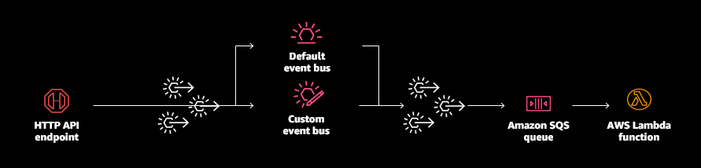
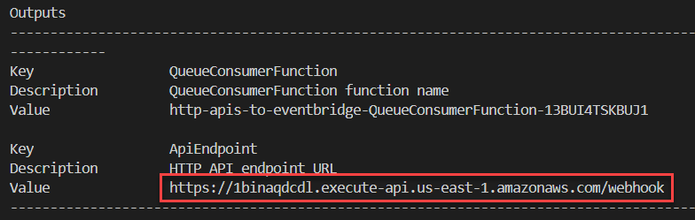
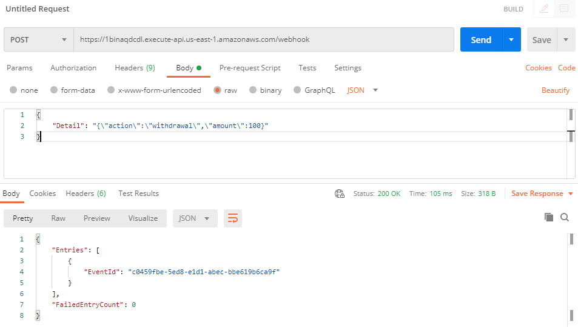
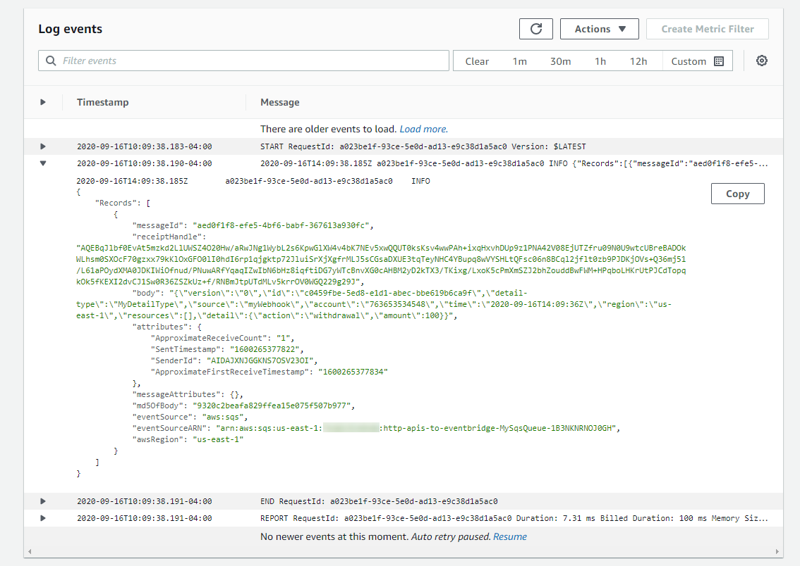

# 1. Scalable webhook

This example creates the following resources:



Important: this application uses various AWS services and there are costs associated with these services after the Free Tier usage - please see the [AWS Pricing page](https://aws.amazon.com/pricing/) for details. You are responsible for any AWS costs incurred. No warranty is implied in this example.

In this folder:

```bash
.
├── README.MD       <-- This instructions file
├── code            <-- AWS Lambda function code
└── template.yaml   <-- AWS SAM template
```

## Requirements

* AWS CLI already configured with Administrator permission
* [AWS SAM CLI installed](https://docs.aws.amazon.com/serverless-application-model/latest/developerguide/serverless-sam-cli-install.html)
* [NodeJS 12.x installed](https://nodejs.org/en/download/)

## Installation Instructions

1. [Create an AWS account](https://portal.aws.amazon.com/gp/aws/developer/registration/index.html) if you do not already have one and login.

2. Clone the main repo onto your local development machine using `git clone`.

3. From the command line:
```
cd ./1-scalable-webhook
sam deploy --guided
```
Follow the prompts in the deploy process to set the stack name, AWS Region and other parameters.

4. Take a note of the API endpoint URL from the outputs: 



5. Using [Postman](https://www.postman.com/downloads/), send a POST request to the endpoint with a JSON payload as follows:



6. In the [AWS Lambda console](https://console.aws.amazon.com/lambda), open the deployed Lambda function matching the outputs.

7. Open the *Monitoring* tab and choose *View logs in CloudWatch*. The latest log stream shows the payload submitted to the API endpoint.



## How it works

This pattern shows how to durably persist messages sent via an HTTP APIs webhook to an SQS via EventBridge, using a direct service integration. 

1. AWS SAM deploys all the resources shows in the above architecture.
1. When you make the POST request to the HTTP API endpoint, the JSON payload is mapped to the Detail attribute in an event sent to EventBridge.
1. EventBridge sends the event to the SQS queue.
1. The consuming Lambda function receive this message from SQS and logs out the message.

==============================================

Copyright 2020 Amazon.com, Inc. or its affiliates. All Rights Reserved.

SPDX-License-Identifier: MIT-0