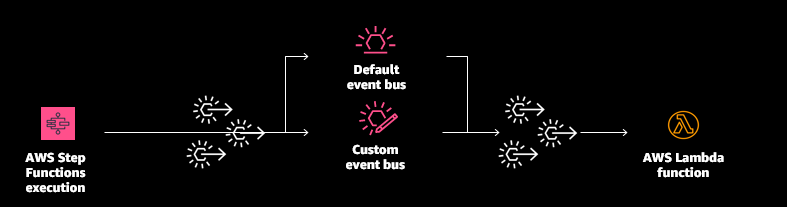
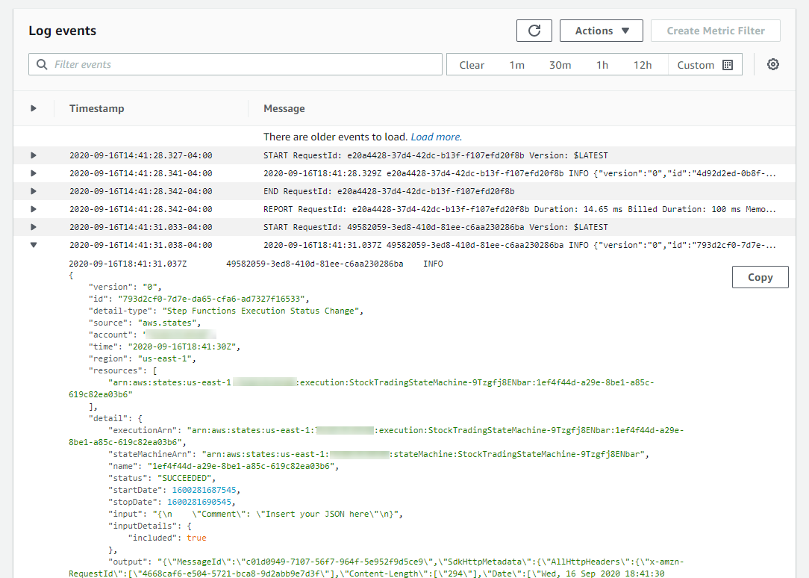

# 2. Responding to AWS Step Functions workflows

This example creates the following resources:



Important: this application uses various AWS services and there are costs associated with these services after the Free Tier usage - please see the [AWS Pricing page](https://aws.amazon.com/pricing/) for details. You are responsible for any AWS costs incurred. No warranty is implied in this example.

In this folder:

```bash
.
├── README.MD       <-- This instructions file
├── code            <-- AWS Lambda function code
└── template.yaml   <-- AWS SAM template
```

## Requirements

* AWS CLI already configured with Administrator permission
* [AWS SAM CLI installed](https://docs.aws.amazon.com/serverless-application-model/latest/developerguide/serverless-sam-cli-install.html)
* [NodeJS 12.x installed](https://nodejs.org/en/download/)

## Installation Instructions

1. [Create an AWS account](https://portal.aws.amazon.com/gp/aws/developer/registration/index.html) if you do not already have one and login.

2. You need an existing Step Functions workflow for testing. If you don't have one, go to the [Step Functions console](https://console.aws.amazon.com/states/home) and choose *Create state machine*. Deploy any one of the samples for testing.

3. Clone the main repo onto your local development machine using `git clone`.

4. From the command line:
```
cd ./2-responding-to-workflows
sam deploy --guided
```
Follow the prompts in the deploy process to set the stack name, AWS Region and other parameters.

5. Run the existing state machine.

6. In the [AWS Lambda console](https://console.aws.amazon.com/lambda), open the deployed Lambda function matching the outputs.

7. Open the *Monitoring* tab and choose *View logs in CloudWatch*. The latest log stream shows the payload submitted to the API endpoint.



## How it works

This pattern shows how to receive and respond to events emitted from Step Functions state machines. These are automatically published to EventBridge without any additional changes required.

1. AWS SAM deploys all the resources shows in the above architecture.
1. You run a Step Functions state machine execution.
1. The events are captured by EventBridge and routed to the sample Lambda function.

==============================================

Copyright 2020 Amazon.com, Inc. or its affiliates. All Rights Reserved.

SPDX-License-Identifier: MIT-0